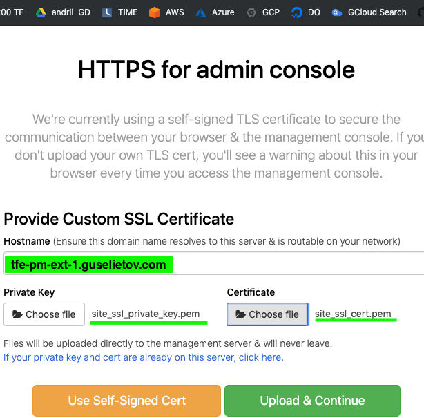
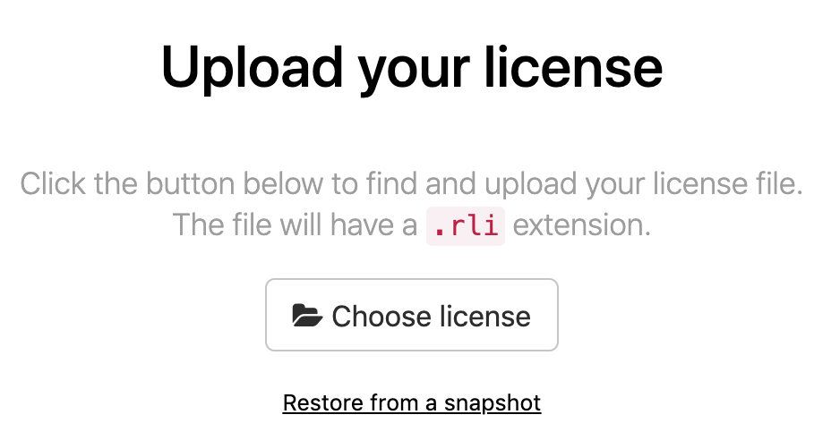
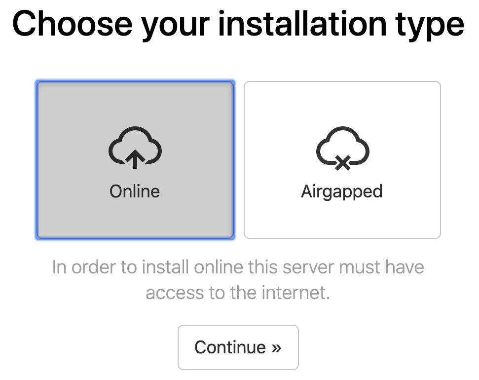
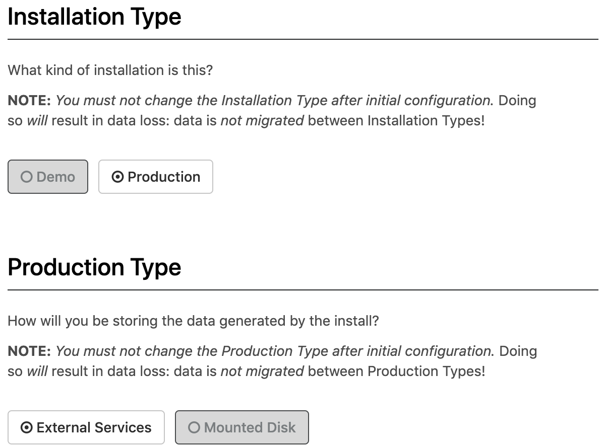
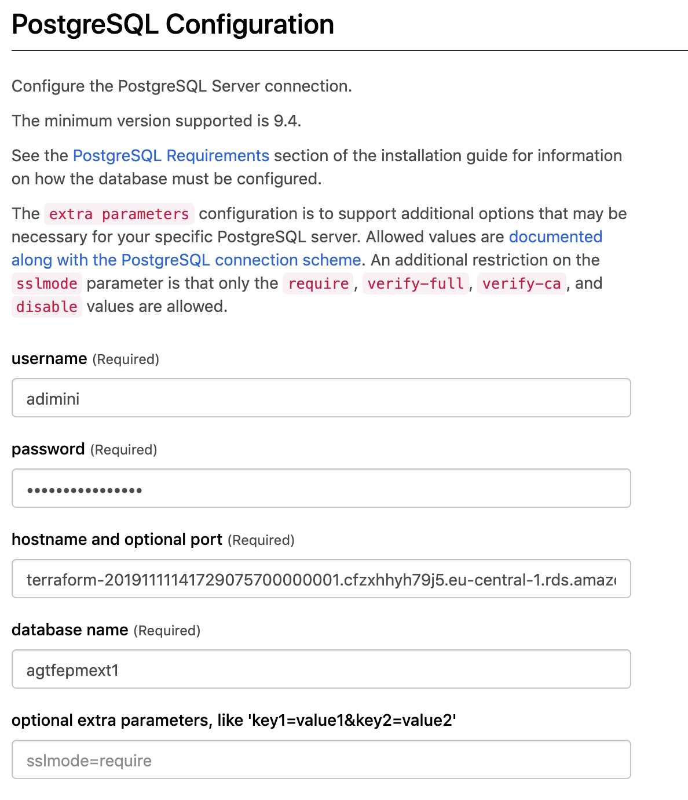
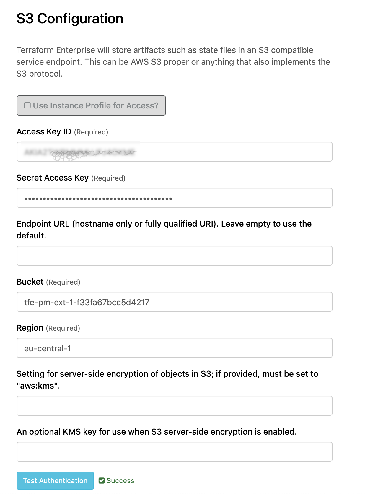
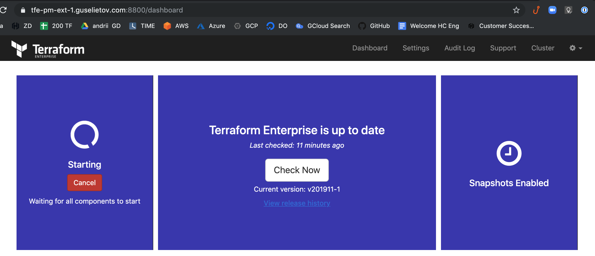
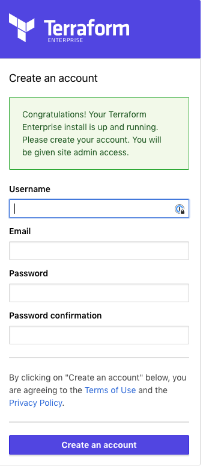
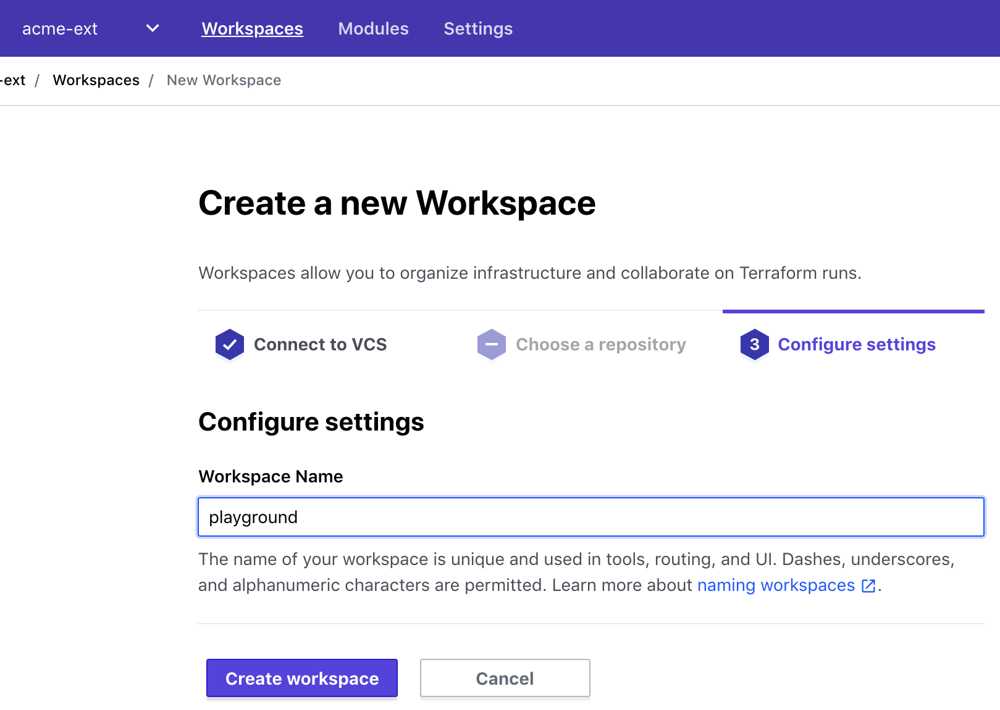

# ptfe-prod-ext
TFE - Install Prod External Services version with Valid Certificate - AWS

Based on: https://github.com/Galser/ptfe-prodmount-vc-cloud-backuprestore

# Purpose

This repo contains all the code and instructions on how to install a TFE (Prod) version with a Valid Certificate in an AWS cloud environment in external services mode. 

# Requirements

This repository assumes general knowledge about Terraform, if not, please get yourself accustomed first by going through [getting started guide for Terraform](https://learn.hashicorp.com/terraform?track=getting-started#getting-started). We also going to use AWS EC2 as our infrastructure provider, DNS service of CloudFlare and SSL Certificates from LetsEncrypt.

To learn more about the mentioned above tools and technologies - please check section [Technologies near the end of the README](#technologies)

# How-to

## Prepare authentication credentials
- Beforehand, you will need to have SSH RSA key available at the default location :
 - `~/.ssh/id_rsa` and `~/.ssh/id_rsa.pub`
 > This key is going to be used later to connect to the instance where TFE will be running.
 
- Prepare AWS auth credentials (You can create security credentials on [this page](https://console.aws.amazon.com/iam/home?#security_credential).) To export them via env variables, execute in the command line :
 ```
 export AWS_ACCESS_KEY_ID="YOUR ACCESS KEY"
 export AWS_SECRET_ACCESS_KEY="YOUR SECRET KEY"
 ```
- Prepare CloudFlare authentication for your domain DNS management - register and export as env variables API keys and tokens. Follow instructions from CloudFlare here: https://support.cloudflare.com/hc/en-us/articles/200167836-Managing-API-Tokens-and-Keys
 - Export generated token and API keys :
 ```bash
 export CLOUDFLARE_API_KEY=YOUR_API_KEY_HERE
 export CLOUDFLARE_API_TOKEN=YOUR_TOKEN_HERE
 export CLOUDFLARE_ZONE_API_TOKEN=YOUR_TOKEN_HERE
 export CLOUDFLARE_DNS_API_TOKEN=YOUR_TOKEN_HERE
 ```

## Deploy infrastructure
- Clone this repo (*use the tools of your choice*)
- Open the folder with cloned repo
- Define your domain name in [variables.tf](variables.tf), edit on 2-nd line, following block : 
 ```terraform
 variable "site_domain" {
   default = "guselietov.com"
 }
 ```
- Define your domain site (host) record in [variables.tf](variables.tf), edit on 6-s line, following block : 
 ```terraform
 variable "site_record" {
   default = "tfe-pm-ext-1"
 }
 ```

- From inside folder with cloned repo init Terraform by executing : 
```
terraform init
```
Example output can be found here : [terraform_init.md](terraform_init.md)

- Now let's spin up everything, by executing :
```
terraform apply -auto-approve
```
Example FULL output can be found here : [terraform_apply.md](terraform_apply.md)

Execution will take some time, and at the very end of the output you should see something similar to : 
```bash
Outputs:

backend_fqdn = tfe-pm-ext-1_backend.guselietov.com
cert_url = https://acme-v02.api.letsencrypt.org/acme/cert/04b92183901931ABC123E123
db_endpoint = terraform-20191113133219046400000002.cfzxhhyh79j5.eu-central-1.rds.amazonaws.com:5432
db_name = agtfepmext1
db_password = lY....SOME_PASSWORD_GOING_TO_BE_HERE
db_user = adimini
full_site_name = tfe-pm-ext-1.guselietov.com
loadbalancer_fqdn = ag-clb-ag-clb-tfe-pm-ext-1-989680091.eu-central-1.elb.amazonaws.com
object_storage_id = tfe-pm-ext-1-45c1dc05936465e5
public_ip = 18.185.105.43
region = eu-central-1
```
- Please note that the successful `apply` should create 3 files with SSL certificate information in local folder : 
```bash
# ls -l site*
-rwxr-xr-x 1 andrii staff 1944 Nov 11 16:05 site_ssl_cert.pem
-rwxr-xr-x 1 andrii staff 3594 Nov 11 16:05 site_ssl_cert_bundle.pem
-rwxr-xr-x 1 andrii staff 1675 Nov 11 16:05 site_ssl_private_key.pem
```
We are going to use them later. 

## Terminal-based portion of TFE installation
- Connect to VM : 
```bash
ssh ubuntu@tfe-pm-ext-1_backend.guselietov.com
``` 
> Note: Use the `public_ip` or `backend_fqdn` from the previous step

- Start the PTFE install: 
```curl https://install.terraform.io/ptfe/stable | sudo bash```
 - use Public IP-address from previous steps ( `18.185.179.32` in the example ) for the service question. You can just press [Enter],
 - Reply `N` to proxy question. Again - you can just press [Enter]
 Output example : 
 ```bash
 # Executing docker install script, commit: UNKNOWN
 + sh -c apt-get update -qq >/dev/null
 + sh -c apt-get install -y -qq apt-transport-https ca-certificates curl >/dev/null
 ...
 Operator installation successful

 To continue the installation, visit the following URL in your browser:

 http://18.185.179.32:8800

 ```
This concludes the terminal install portion. let's continue in Web UI.

## Web-based portion of TFE installation

- Open your favorite browser and access the link that had been presented to you at the previous step: http://18.185.179.32:8800 , As we using self-signed certificates for this part of the installation, you will see a security warning when first connecting. **This is expected and you'll need to proceed with the connection anyway.**
- Now you will be presented with settings screen "HTTPS for Admin Console" :



 Where you will need to
 - enter hostname: `tfe-pm-ext-1.guselietov.com` ( *this used in the example, you may have another one if you modified settings earlier* )
 - Choose File for Private Key ( point to `site_ssl_private_key.pem` in the current folder)
 - Choose File for Certificate ( point to `site_ssl_cert.pem` in the current folder)
 - and press green button **[Upload & Continue]**

 > Sometimes, depending on the speed of instance connection and external resources replies you will fail to access this screen because load-balancer could not detect that Terraform Dashboard already running and removed it from service. Just wait 30 seconds and refresh the page.
- Now you will need to present your license file. Usually, it comes in a special tar-ball package with extension RLI. Press **[Choose license]**, Locate the file and upload.



 > And now you should be automatically redirected to the new URL: `https://tfe-pm-ext-1.guselietov.com:8800/`
 > and the "lock" icon next to the FQDN of the site in the URL bar is closed, meaning that certificate recognized as valid by the browser and corresponds to the address of the site.
- The next screen allows you to select between *Online* and *air-gapped* installation. Choose **[Online]** :

And press **[Continue]** button
- On the next step, you will need to enter the password, that can be used in the future to access THIS, Admin Console :

Enter the desired password, and press continue
- Now you will see the *"Preflight Checks"* when all the main requirements for the PTFE installation checked and the one that passed marked with a green checkmark. They ALL should be green to pass.
Once more, press **[Continue]** button
- The next screen presents all your settings in one place
 - Check that host FQDN is correct ( `tfe-pm-ext-1.guselietov.com` )
 - Scroll down to the *Installation Type* section and select **[Production]**
 - I next section below *Production Type* section and select **[External Services]** :

 

 - Now scroll down to *PostgreSQL COnfiguration* and fill in the fields : 
 - Username - you have in the apply log of the Terraform, in outputs, in this line : 
 `db_user = adimini`
 - Password - you have in the apply log of the Terraform, in outputs, in this line : 
 `db_password = lYO6ZNoLX0-QX5rZ`
 - Hostname and optional port - take from the output `db_endpoint` at the end of the apply run :
 `db_endpoint = terraform-20191112145444196200000001.cfzxhhyh79j5.eu-central-1.rds.amazonaws.com:5432` 
 - Database name - should come from the Terraform output also :
 `db_name = agtfepmext1`

 Consult screenshot for the guidance : 
 
 

 - Scroll down, in the *Object Storage* section select **[S3]**, and start filling the section below *S3 Configuration* as follows :
 - Make sure checkbox *Use Instance Profiel for Access* is *not enabled*
 - Enter your *AWS Access Key ID* and *Secret Access Key* in corresponding fields
 - Enter *Bucket* name , take it from Terraform Output line : 
 `object_storage_id = tfe-pm-ext-1-f33fa67bcc5d4217`
 - Enter *Region*, again , take it from it from Terraform Output 
 `region = eu-central-1`

 Check the example fill of the form at screenshot : 

 

 - Scroll to the next section: *SSL/TLS Configuration* - and paste the contents of your SSL Certificate bundle here
 ( Use the contents of the file `site_ssl_cert_bundle.pem` from current folder)
 After that - press **[Save]** button at the bottom of the page to save all your settings. And you going to be present with the following informational screen :
 
 Press **[Restart Now]**

- At this moment PTFE will do a full start of all internal services, it can take a couple of minutes, refresh the windows from time to time :



 > Note:..Depending on your browser and/or browser settings the starting in the left part of Dashboard - never changes unless you reload the page. So force-reload the page after 2-3 minutes.
- Wait a couple of minutes for the state at the left rectangle to be changed to **Started**. Now, below the button [Stop now] there is link **[Open]** :

 

 Open it, this will lead you to the first-time setup of the admin user :
- Set up your admin user :

 

 Fill in the form and press **[Create an account]**
- Now you are logged-in, create organization and workspace in it, for the demo, we have organization *"acme-ext"* and workspace *"playground"* (No VCS connection required) :

 

 > Names do not matter in this case

Ok - you have new PTFE installation with organization and workspace running - installation is done.

When you satisfied with all your tests - you can destroy the whole infrastructure by executing in the cloned repo folder :
```bash
terraform destroy
```
And answering 'yes' to the question.


# TODO

# DONE
- [x] define objectives 
- [x] create (reuse) code for compute and cert infrastructure
 - [x] add DB deploy
 - [x] add object storage deploy
- [x] install TFE in Prod mode
- [x] update README
- [x] destroy all and re-run using instructions, fix README if required


# Run logs

- terraform init : [terraform_init.md](terraform_init.md)
- terraform apply : [terraform_apply.md](terraform_apply.md)
- terraform destroy  : [terraform_destroy.md](terraform_destroy.md)


# Technologies

1. **To download the content of this repository** you will need **git command-line tools**(recommended) or **Git UI Client**. To install official command-line Git tools please [find here instructions](https://git-scm.com/book/en/v2/Getting-Started-Installing-Git) for various operating systems. 

2. **For managing infrastructure** we using Terraform - open-source infrastructure as a code software tool created by HashiCorp. It enables users to define and provision a data center infrastructure using a high-level configuration language known as Hashicorp Configuration Language, or optionally JSON. More you encouraged to [learn here](https://www.terraform.io).
 - Specifically, we going to use Terraform for creating infrastructure, and install Terraform Enterprise. TFE Overview: can be found here: https://www.terraform.io/docs/enterprise/index.html
 - Pre-Install checklist: https://www.terraform.io/docs/enterprise/before-installing/index.html

3. **This project for virtualization** uses **AWS EC2** - Amazon Elastic Compute Cloud (Amazon EC2 for short) - a web service that provides secure, resizable compute capacity in the cloud. It is designed to make web-scale cloud computing easier for developers. You can read in details and create a free try-out account if you don't have one here : [Amazon EC2 main page](https://aws.amazon.com/ec2/) 

4. **Cloudflare**, - is an American web infrastructure and website security company, providing content delivery network services, DDoS mitigation, Internet security, and distributed domain name server services. More information can be found here: https://www.cloudflare.com/ 

5. **Let'sEncrypt** - Let's Encrypt is a non-profit certificate authority run by Internet Security Research Group that provides X.509 certificates for Transport Layer Security encryption at no charge. The certificate is valid for 90 days, during which renewal can take place at any time. You can find out more on their [official page](https://letsencrypt.org/)
